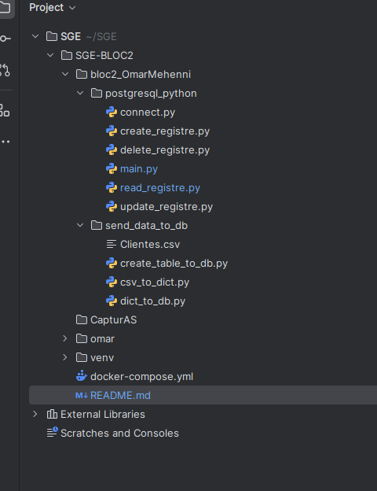
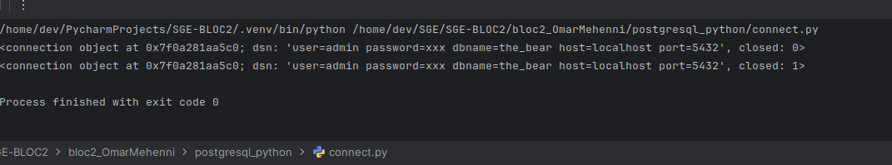
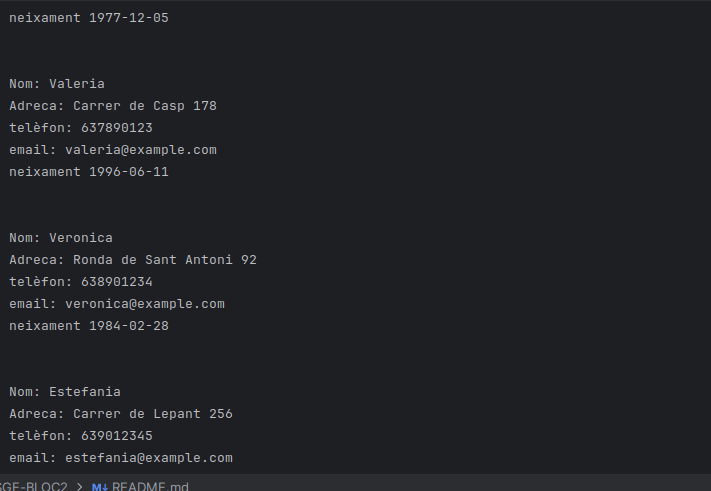

# SGE-BLOC2
# Automatización de una Tabla de Clientes con Python y PostgreSQL

En este proyecto, estoy trabajando con una tabla de clientes en la que quiero realizar operaciones básicas como:

- Insertar un nuevo usuario.
- Leer los usuarios existentes.
- Modificar los datos de un usuario.
- Eliminar un usuario por completo.

Todo este trabajo, que en Excel se hace manualmente, se puede automatizar utilizando Python y una base de datos (BD) mediante la librería `psycopg2`, que permite trabajar con PostgreSQL desde Python.

En las siguientes líneas, probaré paso a paso cómo realizar esta conexión.

Se ha organizado el proyecto creando la carpeta `bloc2_NOMALUMNX`, con una subcarpeta `postgresql_python` que contiene los archivos principales del sistema: `connect.py`, `main.py`, `create_registre.py`, `read_registre.py`, `update_registre.py` y `delete_registre.py`. Todo se puede gestionar desde un IDE como VSCode o PyCharm.

 
# Conexión a la base de datos con Python y PostgreSQL

En este paso, hemos creado el archivo `connect.py`, que permite conectar a una base de datos PostgreSQL. El código utiliza la librería `psycopg2`, que facilita la interacción con PostgreSQL desde Python. Hemos configurado los parámetros de conexión con la información proporcionada en el archivo `docker-compose.yml`, incluyendo el nombre de la base de datos ("the_bear"), el usuario ("admin"), la contraseña ("admin"), el host ("localhost") y el puerto ("5432").

Esta conexión es fundamental para realizar las operaciones de gestión de la tabla de clientes: insertar, leer, actualizar y eliminar datos (CRUD). Una vez validada la conexión, podremos empezar a implementar estas funcionalidades en el proyecto.
# Creación de la tabla y carga de datos desde un CSV a la base de datos

En este paso, se realizará una prueba para verificar si la conexión a la base de datos es correcta. Para ello, es necesario tener los servicios de `docker-compose.yml` creados y activos. Una vez que los servicios estén en funcionamiento y podamos verlos en pgAdmin 4, se procederá a crear un script en Python para crear la tabla con los datos de los clientes en la base de datos.

## Pasos a seguir

### 1. Crear un script para pasar los datos de un CSV a la base de datos

Deberás descargar el archivo de clientes en formato `.csv` y agregarlo a una carpeta llamada `send_data_to_db` que estará dentro de la carpeta `bloc2`.

La estructura de los archivos dentro de `send_data_to_db` será la siguiente:

- `create_table_to_db.py`: Este script servirá para crear la tabla en la base de datos con los campos (sin registros) según el archivo `.csv` de clientes.
- `csv_to_dict.py`: Este script transformará la información del archivo `.csv` en formato diccionario.
- `dict_to_db.py`: Este script insertará los datos del diccionario en la base de datos, campo por campo (columna por columna).

### 2. Crear la tabla en la base de datos

El script `create_table_to_db.py` se encargará de crear la tabla correspondiente en la base de datos a partir de las cabeceras del archivo `.csv`. 

### 3. Convertir el CSV a un diccionario

El script `csv_to_dict.py` leerá el archivo `.csv` y convertirá cada fila en un diccionario, donde las claves serán las cabeceras del archivo y los valores serán los datos correspondientes.

### 4. Insertar los datos en la base de datos

El script `dict_to_db.py` tomará el diccionario generado y se encargará de insertar los datos en la base de datos, columna por columna, asegurando que cada campo se corresponda con el campo adecuado en la tabla de la base de datos.

# Creación de un registro en la tabla `Clientes`

## 1. Explicación del archivo `create_registre.py`

Este archivo contiene una función que permite insertar un nuevo registro en la tabla `Clientes` de la base de datos PostgreSQL. La función establece una conexión con la base de datos, ejecuta una consulta SQL para insertar los datos en la tabla y luego cierra la conexión.

## 2. Explicación del archivo `main.py`

En este archivo se llama a la función `create_reg()` definida en `create_registre.py` para probar la inserción del registro en la base de datos. Al ejecutar este archivo, se ejecuta la función que inserta un nuevo registro en la tabla `Clientes`.

## 3. Proceso de inserción

Cuando se ejecuta el archivo `main.py`, la función `create_reg()` inserta un nuevo registro con los valores especificados en la tabla `Clientes`.

# Continuación del proyecto

Una vez que se hayan insertado los datos en el punto 7, será necesario agregar el código de los archivos restantes: `read_registre.py`, `update_registre.py` y `delete_registre.py`. La estructura de código de estos tres archivos será muy similar a la de `create_registre.py`, pero con algunas modificaciones.

## READ_REGISTRE.PY

Una vez creado el archivo `read_reg()`, se deberá llamar a `read_reg()` desde `main.py` de dos formas: una para mostrar el tipo de dato utilizando `type`, y luego, sabiendo el tipo, extraer la información de cada campo (columna) e imprimirla.

Es recomendable consultar el documento de **LISTS** para aprender cómo extraer información de una lista. Después de completar el tutorial sobre **LISTS**, se puede regresar a este paso.

# Extracción de información de una lista en Python

Trabajando sobre el archivo `read_registre.py` y utilizando una consulta SELECT en PostgreSQL, si deseamos ver todos los datos.

# Extracción de un registro específico de la lista

Después de haber obtenido y mostrado todos los resultados de la consulta, el siguiente paso es extraer un registro específico de la lista. Imaginemos que deseamos obtener el registro donde el `id_cliente = 5` y mostrar todos los datos de dicho registro.

 mostrar del id_cliente = 5 el teléfono

Este permite filtrar los datos obtenidos de la base de datos y centrarse en un registro particular para su visualización o manipulación posterior.

# Ejercicio 

# 1. Los datos de Andreu

## 2 El correo de Andreu

## 3 Les dades de la Vivian

## 4 La direcció de la Vivian

## 5 Les dades de l’Albert

## 6 La data de cumpleanys de l’Albert

# Visualización de los Registros de Clientes

El código en el archivo `main.py` permite mostrar los registros de los clientes de manera estructurada. La función `create_reg()` inserta un nuevo cliente en la base de datos, y luego la función `read_reg()` recupera todos los registros. A continuación, se imprimen los datos de cada cliente, incluyendo su nombre, dirección, teléfono, correo electrónico y fecha de nacimiento.

Cada registro se muestra de manera estructurada, con un salto de línea entre cada cliente para facilitar la lectura.

